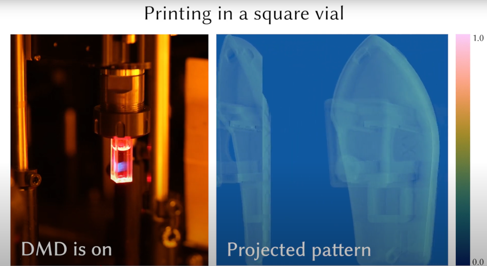

<!-- PROJECT LOGO -->
<br />
<p align="center">

  <h1 align="center"><a href="https://rgl.epfl.ch/publications/Nicolet2024Inverse">Dr.TVAM</a></h1>

  <a href="https://rgl.epfl.ch/publications/Nicolet2024Inverse">
    
  </a>

  <p align="center">
    ACM Transactions on Graphics (Proceedings of SIGGRAPH Asia), December 2024.
    <br />
    <a href="https://bnicolet.com/"><strong>Baptiste Nicolet</strong></a>
    ·
    <a href="https://www.felixwechsler.science/"><strong>Felix Wechsler</strong></a>
    ·
    <a href="https://www.linkedin.com/in/jorge-madrid-wolff/"><strong>Jorge Madrid-Wolff</strong></a>
    ·
    <a href="https://www.epfl.ch/labs/lapd/page-67957-en-html/"><strong>Christophe Moser</strong></a>
    ·
    <a href="https://rgl.epfl.ch/people/wjakob"><strong>Wenzel Jakob</strong></a>
  </p>

  <p align="center">
    <a href='https://rgl.s3.eu-central-1.amazonaws.com/media/papers/Nicolet2024Inverse.pdf'>
      
    </a>
    <a href='https://rgl.epfl.ch/publications/Nicolet2024Inverse' style='padding-left: 0.5rem;'>
      
    </a>
    <a href='https://drtvam.readthedocs.io/en/latest/' style='padding-left: 0.5rem;'>
      
    </a>
  </p>
</p>

<p align="center">
  <a href='https://rgl-ci.epfl.ch/viewType.html?buildTypeId=DrTVAM_LinuxAmd64gcc9&guest=1'>
    
  </a>
</p>

<br />
<br />


## About this project

Dr.TVAM is a high-performance inverse rendering framework for tomographic volumetric additive
manufacturing. It is based on the [Mitsuba renderer](https://www.mitsuba-renderer.org/), and uses physically-based
differentiable rendering to optimize patterns for TVAM. In particular, it supports:

- Printing in scattering media
- Arbitrary vial shapes (round, square, ...)
- Arbitrary projector motions (orthogonal, tilted)
- An improved discretization scheme for the target shape to reduce computational load and to minimize discretization artifacts

For more details we refer to this [publication](https://rgl.s3.eu-central-1.amazonaws.com/media/papers/Nicolet2024Inverse.pdf).


## ⚠️ Sign up for online workshop in Spring 2025
* The date is not announced yet, but sign up for the announcement: [here](https://forms.office.com/e/3E0SeYUR1X?origin=lprLink)

## Installation

Installing Dr.TVAM can be done via `pip`:

```bash=
pip install drtvam
```

## Basic Usage

We provide a convenience command-line tool `drtvam` to run simple optimizations. You can run it as:

```bash=
drtvam path/to/config.json
```
Please refer to the documentation for details on the configuration file format. 
Dr.TVAM will run multi-threaded on your machine but will also use your CUDA GPU and your [RT cores](https://developer.nvidia.com/rtx/ray-tracing) if supported by your hardware. 

## Advanced Usage

Dr.TVAM provides a set of useful abstractions to implement a wide variety of
custom TVAM setups. We show examples in the documentation to get you started.

## Documentation

The full documentation for this project, along with jupyter notebooks
explaining the basics of implementing your own optimizations in our framework,
can be found on [readthedocs](https://drtvam.readthedocs.io/en/latest/).

## Teaser video
Can be found on YouTube:

<a  href="https://www.youtube.com/watch?v=w6weg4noMIY"></a>

## Issues or support needed
In case you run into issues or you do need support, do not hesitate to [open an issue](https://github.com/rgl-epfl/drtvam/issues/new) such that we can help you using Dr. TVAM!
As an academic user, this is completely free to use. Please reach out to us in case you need support!

## License

This project is provided under a non-commercial license. Please refer to the LICENSE file for details.

## Citation

When using this project in academic works, please cite the following paper:

```
@article{nicolet2024inverse,
    author = {Nicolet, Baptiste and Wechsler, Felix and Madrid-Wolff, Jorge and Moser, Christophe and Jakob, Wenzel},
    title = {Inverse Rendering for Tomographic Volumetric Additive Manufacturing},
    journal = {Transactions on Graphics (Proceedings of SIGGRAPH Asia)},
    volume = {43},
    number={6},
    year = {2024},
    month = dec,
    doi = {10.1145/3687924}
}
```

