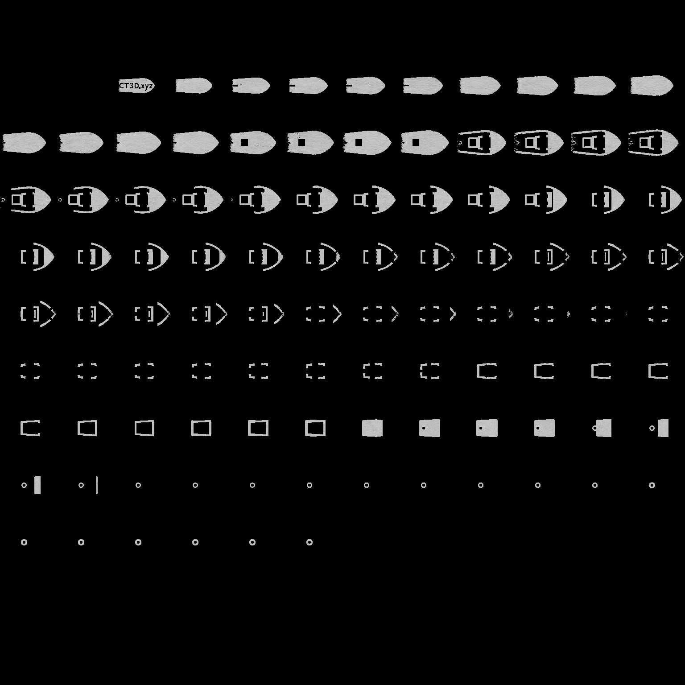
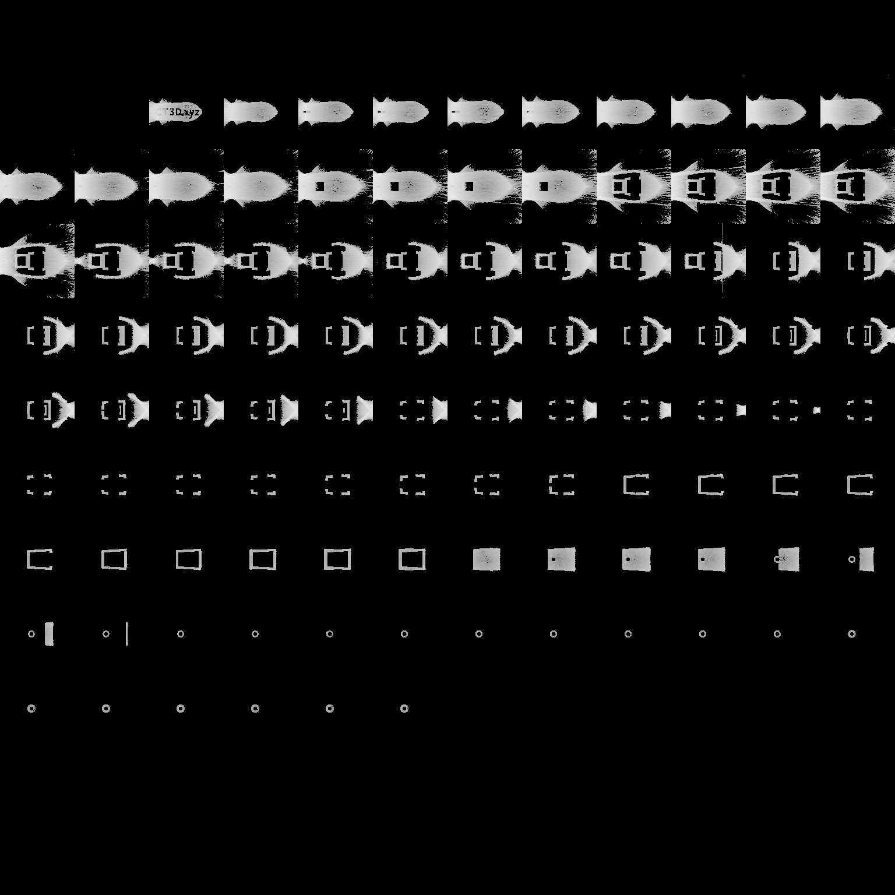

.. _forward_projection:

Forward projection only
=======================
We can also use the following convenience options in Dr.TVAM to optimize patterns under certain conditions but then project them under different conditions.

Normal optimization
-------------------

As always we can optimize patterns with ``drtvam no_absorption/config.json``. 

.. raw:: html

   

   
<a>Config file no_absorption/config.json (click to expand)</a>

.. code-block:: json

    {
        "vial": {
            "type": "cylindrical",
            "r_int": 5,
            "r_ext": 5.5,
            "ior": 1.58,
            "medium": {
                "ior": 1.4849,
                "phase": {
                    "type": "rayleigh"
                },
                "extinction": 0.01,
                "albedo": 0.0
            }
        },
        "projector": {
            "type": "collimated",
            "n_patterns": 100,
            "resx": 200,
            "resy": 200,
            "pixel_size": 0.04,
            "motion": "circular",
            "distance": 20
        },
        "sensor": {
            "type": "dda",
            "scalex": 7.2,
            "scaley": 7.2,
            "scalez": 7.2,
            "film": {
                "type": "vfilm",
                "resx": 128,
                "resy": 128,
                "resz": 128
            }
        },
        "target": {
            "filename": "../benchy.ply",
            "size": 7.0
        },
        "loss": {
            "type": "threshold",
            "tl": 0.80,
            "tu": 0.94,
            "weight_sparsity": 0.0,
            "M": 4
        },
        "transmission_only": true,
        "n_steps": 30,
        "spp": 4,
        "spp_ref": 4,
        "spp_grad": 4
    }

.. raw:: html

   

The resulting ``final.exr`` (after thresholding) looks like this:

We can guess it looks like good intensity to produce a boat

Forward projection
------------------
Using the existing patterns, we can now simulate a real print (forward projection only) under new conditions. 
In this case, we want to simulate the same patterns but under a higher absorption condition.
Call

``drtvam --forward_mode --patterns no_absorption/patterns.npz absorption/config.json``

.. raw:: html

   

   
<a>Config file absorption/config.json (click to expand)</a>

.. code-block:: json

    {
        "vial": {
            "type": "cylindrical",
            "r_int": 5,
            "r_ext": 5.5,
            "ior": 1.58,
            "medium": {
                "ior": 1.4849,
                "phase": {
                    "type": "rayleigh"
                },
                "extinction": 0.4,
                "albedo": 0.0
            }
        },
        "projector": {
            "type": "collimated",
            "n_patterns": 100,
            "resx": 200,
            "resy": 200,
            "pixel_size": 0.04,
            "motion": "circular",
            "distance": 20
        },
        "sensor": {
            "type": "dda",
            "scalex": 7.2,
            "scaley": 7.2,
            "scalez": 7.2,
            "film": {
                "type": "vfilm",
                "resx": 128,
                "resy": 128,
                "resz": 128
            }
        },
        "target": {
            "filename": "../benchy.ply",
            "size": 7.0
        },
        "loss": {
            "type": "threshold",
            "tl": 0.80,
            "tu": 0.94,
            "weight_sparsity": 0.0,
            "M": 4
        },
        "transmission_only": true,
        "n_steps": 30,
        "spp": 4,
        "spp_ref": 4,
        "spp_grad": 4
    }

.. raw:: html

   

This command will use the patterns from ``no_absorption/patterns.npz`` but project them under the conditions defined in ``absorption/config.json``. 
The resulting files (such as ``final.exr``) will be saved in the ``absorption/`` directory, but they will be based on the patterns optimized for the lower absorption conditions.

The resulting ``final.exr`` (after thresholding) looks like this:

We can see, the boat is not well preserved as the resin is more absorptive and the patterns are not optimized for this condition.
This example also demonstrates that the unattenuated simulation of rays is not suited for real conditions with absorptive resins.

Hints
-----
The final projection used for ``final.exr`` will not use ``spp``, ``max_depth`` and ``rr_depth`` but instead uses ``spp_ref``, ``max_depth_ref`` and ``rr_depth_ref``.
During the optimization itself, we always use ``spp``, ``max_depth`` and ``rr_depth``.

