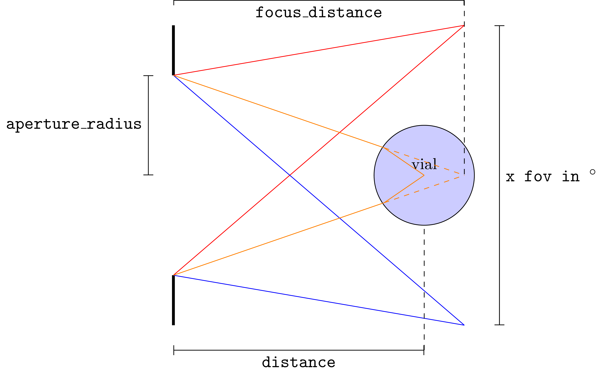

.. _projector:

==========
Projectors
==========

Python API
----------

Make a structure of sections, subsections, paragraphs

Projectors in Dr.TVAM represent the optical system that projects the light
patterns on the resin container. They are child classes of the ``Projector``
class and have two main components:

* The projection model, i.e. collimated or perspective.
* The motion model, that describes the position of the projector relative to the
  resin container as a function of time.

Projectors are implemented as Mitsuba emitters, and can be loaded as:

.. code-block:: python

    projector_dict = {
        'type': 'collimated',
        'n_patterns': 1000,
        'resx': 720,
        'resy': 1080,
        'cropx': 256,
        'cropy': 256,
        'crop_offset_x': 232,
        'crop_offset_y': 412,
        'pixel_size': 0.1,
        'motion': 'circular',
        'distance': 20
    }

The common parameters for all projectors are:

.. list-table::
    :widths: 10 10 80
    :header-rows: 1

    * - Key
      - Type
      - Description

    * - ``type``
      - ``str``
      - The specific type of projector to use. Can be ``collimated`` or ``conebeam``.

    * - ``patterns``
      - ``str``, ``np.ndarray`` or ``mi.TensorXf``
      - Tensor containing the patterns, or path to a file or directory
        containing the patterns. Loading patterns from an ``.npy`` file and from
        individual ``.exr`` files is supported. 

If there are no specific patterns to be loaded, the projector parameters can be
specified manually, and all pixels will be initialized to zero. Those parameters
are:

.. list-table::
    :widths: 10 10 80
    :header-rows: 1

    * - Key
      - Type
      - Description

    * - ``n_patterns``
      - ``int``
      - The number of projection patterns in one rotation.

    * - ``resx``
      - ``int``
      - The resolution of the projector along the horizontal axis. When
        specifying patterns like so, they will be initialized as zeros.

    * - ``resy``
      - ``int``
      - The resolution of the projector along the vertical axis.

    * - ``cropx``
      - ``int``
      - One can specify a crop resolution to only use a part of the projector
        resolution. This is useful for optimization, to reduce the computational
        load while still producing patterns that match the resolution of the
        physical projector. It should be smaller than the base resolution. This
        parameter is optional, and specifies the crop resolution along the
        horizontal axis.

    * - ``cropy``
      - ``int``
      - The crop resolution along the vertical axis.

    * - ``crop_offset_x``
      - ``int``
      - The offset of the crop region along the horizontal axis. This specifies
        the position of the upper left corner of the crop region in the full
        resolution image.

    * - ``crop_offset_y``
      - ``int``
      - The offset of the crop region along the vertical axis.

.. warning::

   Only one of ``patterns`` or the manual parameters should be specified. If
   both are specified, the latter will be ignored.

Conventions
^^^^^^^^^^^

The convention for the projected pattern is that the pixel at index ``(0, 0)``
corresponds to the top-left corner of the image in the projected plane. The
first dimension of the pattern tensor is the angular dimension, then the
vertical dimension, and finally the horizontal dimension.

Docstrings and Examples
-----------------------
Also see :ref:`projector_calibration` for more information on how to calibrate the ``telecentric`` and ``lens`` projectors.

Motion models
^^^^^^^^^^^^^

The motion model defines how the projector moves relative to the resin container
as a function of time. In the real world, the projector doesn't move and the
vial rotates, but it makes more sense to implement it the other way around,
which is equivalent.

Motion model parameters are added alongside the projector parameters. Currently,
only a circular motion around the vertical axis is supported.

.. list-table::
    :widths: 10 10 80
    :header-rows: 1

    * - Key
      - Type
      - Description

    * - ``motion``
      - ``str``
      - The specific type of motion model to use. The only supported motion
        model is ``circular`` at the moment.

    * - ``distance``
      - ``float``
      - The distance between the projector and the resin container.

Below, we detail the two types of projectors available in Dr.TVAM.

Collimated Projector (``collimated``)
^^^^^^^^^^^^^^^^^^^^^^^^^^^^^^^^^^^^^
.. _collimated_projector:

This plugin models a perfectly collimated projector, i.e. the light rays are
parallel to each other. It requires the following additional parameters:

.. list-table::
    :widths: 10 10 80
    :header-rows: 1

    * - Key
      - Type
      - Description

    * - ``pixel_size``
      - ``float`` or ``mi.Point2f``
      - The size of a pixel in the image plane, in scene units. Specifying a
        single float will set the same size for both dimensions.

Example
"""""""

Example usage within `config.json`:

.. code-block:: json

    "projector": {
        "type": "collimated",
        "n_patterns": 1,
        "resx": 740,
        "resy": 700,
        "pixel_size": 20.54e-3,
        "motion": "circular",
        "distance": 150
    },
 

Telecentric Projector (``telecentric``)
^^^^^^^^^^^^^^^^^^^^^^^^^^^^^^^^^^^^^^^
.. _telecentric_projector:

This plugin implements a telecentric projector with an aperture. 
For an ``aperture_radius = 0`` it simplifies to the ``collimated`` projector.
It requires the following additional parameters:

.. list-table::
    :widths: 10 10 80
    :header-rows: 1

    * - Key
      - Type
      - Description

    * - ``pixel_size``
      - ``float`` or ``mi.Point2f``
      - The size of a pixel in the image plane, in scene units.

    * - ``aperture_radius``
      - ``float``
      - The radius of the aperture, in scene units.

    * - ``focus_distance``
      - ``float``
      - The distance from the projector to the focal plane, in scene units.

Example
"""""""

Example usage within `config.json`:

.. code-block:: json

    "projector": {
        "type": "telecentric",
        "n_patterns": 100,
        "resx": 740,
        "resy": 700,
        "aperture_radius": 10.0,
        "pixel_size": 20.54e-3,
        "motion": "circular",
        "distance": 150,
        "focus_distance": 150.0
    },

In thise case the chief rays are parallel to each other and have a numerical aperture of 0.0667. 
It is identical to the example for the collimated projector, except the 
``aperture_radius`` and ``focus_distance`` parameters are added to model the cone of light rays.
If you use such a projector with a non-zero aperture radius, you need to sample more rays per pixel (to capture the effect of the defocus blur).
The parameters ``spp``, ``spp_ref`` and ``spp_grad`` need to be changed, as shown in :ref:`Real World Example <real_world_examples_spp>`. 

Lens Projector (``lens``)
^^^^^^^^^^^^^^^^^^^^^^^^^
.. _lens_projector:

This plugin implements a projector with a spherical lens, and an aperture. It
requires the following additional parameters.

.. list-table::
    :widths: 10 10 80
    :header-rows: 1

    * - Key
      - Type
      - Description

    * - ``fov``
      - ``float``
      - The field of view of the projector in the horizontal axis, in degrees.

    * - ``aperture_radius``
      - ``float``
      - The radius of the aperture, in scene units.

    * - ``focus_distance``
      - ``float``
      - The distance from the projector to the focal plane, in scene units.

Alternatively, the configuration file can be specified by the pixel size in the object space:

.. list-table::
    :widths: 10 10 80
    :header-rows: 1

    * - Key
      - Type
      - Description

    * - ``pixel_size``
      - ``float``
      - The size of a pixel in the image plane, in scene units. 

    * - ``aperture_radius``
      - ``float``
      - The radius of the aperture, in scene units.

    * - ``focus_distance``
      - ``float``
      - The distance from the projector to the focal plane, in scene units.

As the lens projector is unintuitive to use, a schematic representation of the light rays is provided here:

Pixel size and field of view are directly related, and the following equation holds:

.. math::

    \text{pixel_size} \cdot \text{resx} = \tan\left(\frac{\text{fov}}{2}\right) \cdot 2 \cdot \text{focus_distance}

where ``resx`` is the horizontal resolution of the projector, ``fov`` is the field of view in degrees, and ``focus_distance`` is the distance from the projector to the focal plane.

See :ref:`projector_calibration` for more information on how to calibrate the ``lens`` projector.

Example
"""""""

Example usage within `config.json`:

.. code-block:: json

    "projector": {
        "type": "lens",
        "n_patterns": 1,
        "resx": 740,
        "resy": 700,
        "fov": 5.58,
        "aperture_radius": 4.0,
        "focus_distance": 150.0,
        "motion": "circular",
        "distance": 150
    },

In this case the chief rays are not parallel to each other. This system is best calibrated with experimental capture of the patterns (from the side or above).

Alternatively, similar to before the configuration file can be also specified by the 
object space pixel size:

.. code-block:: json

    "projector": {
        "type": "lens",
        "n_patterns": 1,
        "resx": 740,
        "resy": 700,
        "pixel_size": 0.019756,
        "aperture_radius": 4.0,
        "focus_distance": 150.0,
        "motion": "circular",
        "distance": 150
    },

In this case it holds that ``pixel_size * resx == tan(fov / 2) * 2 * focus_distance``.

