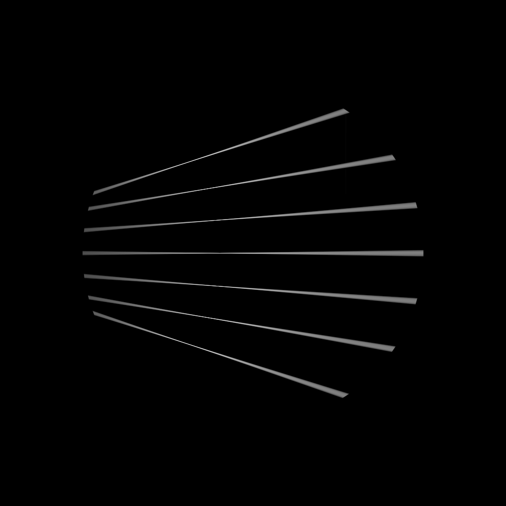
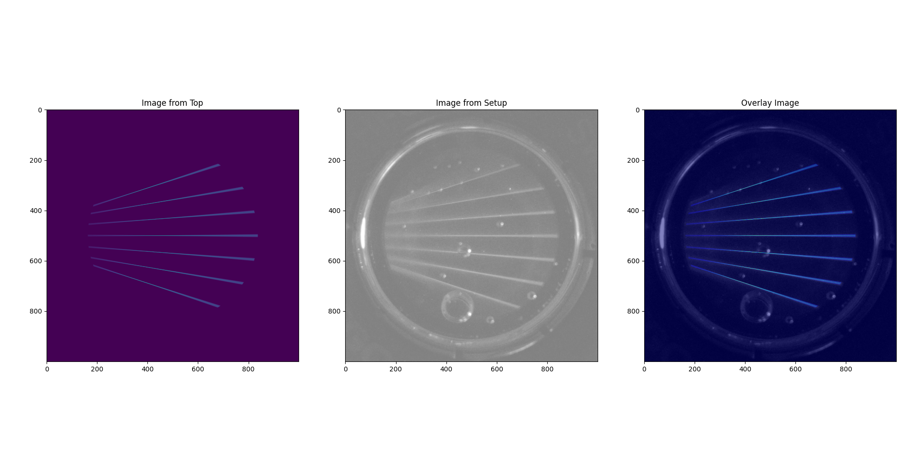

.. _projector_calibration:

Projector Calibration
=====================
This tutorial describes how you can calibrate a ``telecentric``,  ``collimated`` and ``lens`` (perspective) projector.

Trace single projector pixels
-----------------------------
Dr.TVAM has the option to trace single rays instead of doing an optimization.
The following example shows how to trace rays for a single projector pixel.

.. raw:: html

   

   
<a>Config file to trace single rays (click to expand)</a>

.. code-block:: json

    {
        "vial": {
            "type": "cylindrical",
            "r_int": 16.363125,
            "r_ext": 17.354374999999999,
            "ior": 1.00,
            "medium": {
                "ior": 1.00,
                "phase": {
                    "type": "rayleigh"
                },
                "extinction": 0.1,
                "albedo": 0.0
            }
        },
        "projector": {
            "type": "telecentric",
            "n_patterns": 1,
            "resx": 740,
            "resy": 700,
            "aperture_radius": 4.0,
            "pixel_size": 20.54e-3,
            "motion": "circular",
            "distance": 150,
            "focus_distance": 150.0
        },
        "sensor": {
            "type": "dda",
            "scalex": 15.2,
            "scaley": 15.2,
            "scalez": 15.2,
            "film": {
                "type": "vfilm",
                "resx": 1000,
                "resy": 1000,
                "resz": 1
            }
        },
        "target": {
            "filename": "cylinder.ply",
            "size": 1000
        },
        "psf_analysis": [
            {
                "x": 370,
                "y": 350,
                "index_pattern": 0,
                "intensity": 1
            },
            {
                "x": 0,
                "y": 350,
                "index_pattern": 0,
                "intensity": 1
            },
            {
                "x": 739,
                "y": 350,
                "index_pattern": 0,
                "intensity": 1
            }
        ],
        "spp_ref": 10000
    }

.. raw:: html

   

Notable we introduce a ``psf_analysis`` section in the JSON file.
This section contains a list of rays to be traced. Each ray is defined by its ``x`` and ``y`` pixel coordinates, the ``index_pattern`` (which pattern to use), and the ``intensity`` of the ray.
In this case we would turn on the most left pixel, the middle pixel, and the most right pixel of the projector pattern.
If ``drtvam config.json`` is run, it will only trace the rays defined in the ``psf_analysis`` section.
The output intensity traces are written in ``final.exr`` and ``final.npy``. The pixel size of the output is defined by the sensor,
hence the output will be 1000x1000 pixels with a pixel size of 0.0152 mm.
Since the refractive index of the vial is 1.0, the rays will not be refracted and will travel in a straight line, as expected in air.
The rays are attenuated by the extinction coefficient of the medium, which is set to 0.1.

The target is irrelevant for this example, but it is required to run the simulation.

We shoot a total of 10000 rays per pixel, as defined by the ``spp_ref`` parameter. It is possible to change this value to increase or decrease the number of rays per pixel. It makes the results more accurate.
Note, in an optimization, increasing the ``spp`` parameters to such high values, will result in very long optimizations. 
So values around 100 (``spp=100``, ``spp_ref=100`` and ``spp_grad=100``) are more realistic and sufficient for most applications.

Calibration a real ``lens`` projector
-------------------------------------
This example shows how to calibrate a :ref:`real lens projector <lens_projector>` setup.
The parameters for such a projector are ``resx``, ``resy``, ``fov``, ``aperture_radius``, ``focus_distance`` and ``distance``.

A sketch of the parameters is given in this figure.

.. image:: resources/setup_lens_rays.png
  :width: 600

The challenge in the calibration is to find the parameters ``aperture_radis``, ``focus_distance`` and ``distance``. The ``fov`` indicates the field of view in the image plane in x direction in degrees.
This can be simply measured by a ruler. 
But since the ``fov`` also depends on the ``distance``, it is intertwisted with the other parameters. The ``aperture_radius`` is the radius of the aperture which describes how large the light cone 
is going to be. Note, this is a abstract, conceptualized projector so the aperture radius is not the physical aperture of a lens, but rather a parameter that describes the light cone of the projector.

The following config files generates the traces of singles rays through a cylindrical vial filled with a medium. 

.. raw:: html

   

   
<a>Config file lens projector (click to expand)</a>

.. code-block:: json

    {
        "vial": {
            "type": "cylindrical",
            "r_int": 6.363,
            "r_ext": 7.354,
            "ior": 1.54,
            "medium": {
                "ior": 1.4847,
                "phase": {
                    "type": "rayleigh"
                },
                "extinction": 0.11512925464970229,
                "albedo": 0.0
            }
        },
        "projector": {
            "type": "lens",
            "n_patterns": 1,
            "resx": 740,
            "resy": 700,
            "fov": 5.57,
            "aperture_radius": 2.1,
            "focus_distance":  152,
            "motion": "circular",
            "distance": 150
        },
        "sensor": {
            "type": "dda",
            "scalex": 18.90,
            "scaley": 18.90,
            "scalez": 18.90,
            "film": {
                "type": "vfilm",
                "resx": 1000,
                "resy": 1000,
                "resz": 1 
            }
        },
        "target": {
            "filename": "cylinder.ply",
            "size": 1000
        },
        "psf_analysis": [
            {
                "x": 370,
                "y": 350,
                "index_pattern": 0,
                "intensity": 1
            },
            {
                "x": 270,
                "y": 350,
                "index_pattern": 0,
                "intensity": 1
            },
            {
                "x": 170,
                "y": 350,
                "index_pattern": 0,
                "intensity": 1
            },
            {
                "x": 470,
                "y": 350,
                "index_pattern": 0,
                "intensity": 1
            },
            {
                "x": 570,
                "y": 350,
                "index_pattern": 0,
                "intensity": 1
            },
            {
                "x": 670,
                "y": 350,
                "index_pattern": 0,
                "intensity": 1
            },
            {
                "x": 70,
                "y": 350,
                "index_pattern": 0,
                "intensity": 1
            }
    
        ],
        "spp_ref": 8000
    }

.. raw:: html

   

Running ``drtvam this_config.json`` will generate the traces of the rays through the vial. The output in ``final.exr`` should look like this:

In experiment we capture similar traces through a glass vial filled with a medium. To make the trace visible we use fluorescent dye in the medium.
It is important to determine the pixel size of the experimental camera in the focal plane (your imaging system might be not telecentric).
Further, the projected pixels in the real setup should hit the vial as close as possible to the vertical end of the vial. Otherwise there is geometric distortion in the image because of the refractive 
index mismatch between the medium and the air.
We then overlay the experimental image with the simulated traces to find the best fit of the simulated traces to the experimental image.
The strategy is to rotate and move (do not scale) the setup image over the simulated traces until the best fit is found. Then we save the experimental image as new picture.
With the following Python script we can overlay the experimental image with the simulated traces.

.. raw:: html

   

   
<a>Helper script to overlay experimental image with simulated traces (click to expand)</a>

.. code-block:: python

    import matplotlib.pyplot as plt
    import numpy as np
    import imageio
    
    # last dimension is singleton and has no meaning
    img = np.load('final.npy')[:, :, :, 0]
    
    img_from_top = np.sum(img, axis=0)
    
    # here we should load our reference images from the real setups
    # load setup.bmp
    img_from_top_setup = imageio.imread('setup.bmp')
    
    
    # plot the images and also make another row with overlay images
    # top with setup each. Overlay in matplotlib with alpha and colors
    plt.figure(figsize=(10, 5))
    plt.subplot(1, 3, 1)
    plt.imshow(img_from_top)
    plt.title('Image from Top')
    plt.subplot(1, 3, 2)
    plt.imshow(img_from_top_setup, alpha=0.5, cmap='gray')
    plt.title('Image from Setup')
    
    # overlay
    plt.subplot(1, 3, 3)
    plt.imshow(img_from_top_setup, cmap='gray')
    plt.imshow(img_from_top, alpha=0.5, cmap='jet')
    plt.title('Overlay Image')
    
    plt.tight_layout()
    plt.show()

.. raw:: html
   
   

With the following helper script, we can overlay the experimental image with the simulated traces. By running ``drtvam`` and adapting the parameters, we can find the best fit of the simulated traces to the experimental image.
The resulting image is shown in the figure below.

By tweaking the parameters in the config file and running ``drtvam config_psf.json; python overlay.py`` we can find the best fit of the simulated traces to the experimental image in a couple of iterations.

Calibration of a ``collimated`` projector
-----------------------------------------
The calibration of a collimated projector is trivial as the only required property is the ``pixel_size`` of the projector in image plane. 
This can be easily measured with a detector or ruler.

Calibration of a ``telecentric`` projector
------------------------------------------
The calibration of a telecentric projector is more work than the ``collimated`` projector, but less than the ``lens`` projector. 
Additionally to the ``pixel_size``, the ``distance``, ``aperture_radius`` and ``focus_distance`` are required. These can be easily inferred from
an experimental capture image from top (or bottom) through a vial filled with a medium.
