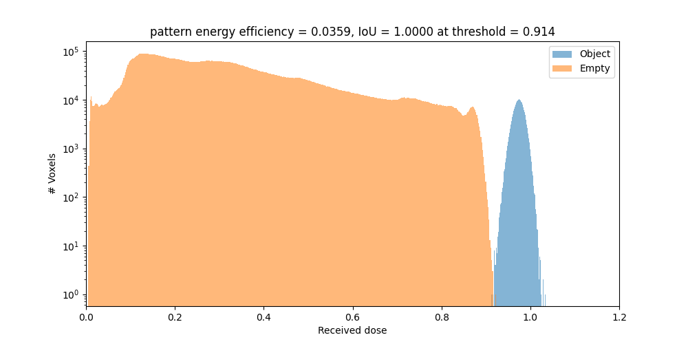
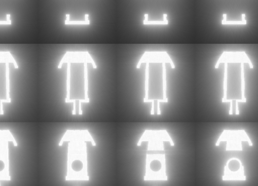

.. _real_world_examples:

Real World Examples
===================

In this section we explain in detail how we use this toolbox to print a real boat with a laser based TVAM setup (``collimated``) .
This is only one example, for more details and options see the other :doc:`tutorials <tutorials>` and the :doc:`plugin documentation <plugin_doc>`.

Resin Preparation
-----------------
For the resin we use the commercial *Sartomer Arkema resin* which mainly consists of *Dipentaerythritol pentaaycrlate*.
As photo initiator we use TPO.
With a refractometer we measure the refractive index :math:`n_\text{resin} = 1.4849`.
We pour the resin into a cup. The photoinitiator is mixed into IPA. This is shaken until the TPO is dissolved.
The IPA with the TPO is mixed into the resin. It is mixed in a Kurabo Planetary Mixer for some minutes. 
In total, we mix roughly :math:`30\mathrm{mg}` of TPO into :math:`40\mathrm{mL}` of the resin.
With a spectrometer, we determine the absorbance at our printing wavelength :math:`405\mathrm{nm}` to be :math:`A=0.2347/1\mathrm{cm}`. That means, :math:`\mu = ln(10)\cdot A / 10 \approx 0.05404\mathrm{mm}^{-1}`-
Technically there is also absorption of the resin itself which does not contribute to the absorption but we determined it to be :math:`A=1.92\mathrm{m^{-1}}`.
So we neglect this effect and assume all absorbed light is contributing to the polymerization.

.. image:: resources/container.jpeg
  :width: 400

Glass Vial
----------
As glass vials we use simple cylindrical glass vial.
With a measurement calliper we determine the outer radius to be :math:`R_\text{outer} = (8.3\pm0.01)\mathrm{mm}` and the inner radius
:math:`R_\text{outer} = (7.6\pm 0.01)\mathrm{mm}`. The refractive index is roughly :math:`n_\text{vial}=1.58`.

.. image:: resources/vial.jpeg
  :width: 400

DMD Characterization
--------------------
We have a camera system which images the printing path at the center of the vial.
After our 4f printing optical system, the DMD pixel pitch is :math:`13.79\mathrm{\mu m}`.

Selecting a Target
------------------
In this case we optimize the  3D Benchy (https://3dbenchy.com/) as a printing target.

Specifying Optimization Parameters
----------------------------------
.. _real_world_examples_spp:

We specify the optimization parameters with a JSON file. Below is an example of a JSON file which we use for the optimization:

.. raw:: html

   

   
<a>Config file (click to expand)</a>

.. code-block:: json

    {
        "vial": {
            "type": "cylindrical",
            "r_int": 7.6,
            "r_ext": 8.3,
            "ior": 1.58,
            "medium": {
                "ior": 1.4849,
                "phase": {
                    "type": "rayleigh"
                },
                "extinction": 0.054,
                "albedo": 0.0
            }
        },
        "projector": {
            "type": "collimated",
            "n_patterns": 300,
            "resx": 400,
            "resy": 400,
            "pixel_size": 0.0137,
            "motion": "circular",
            "distance": 20
        },
        "sensor": {
            "type": "dda",
            "scalex": 5,
            "scaley": 5,
            "scalez": 5,
            "film": {
                "type": "vfilm",
                "resx": 256,
                "resy": 256,
                "resz": 256,
            }
        },
        "target": {
            "filename": "lol/lel/foo/benchy.ply",
            "size": 5.0
        },
        "loss": {
            "type": "threshold",
            "tl": 0.88,
            "tu": 0.95,
            "weight_sparsity": 0.0,
            "M": 4
        },
        "n_steps": 30,
        "spp": 4,
        "spp_ref": 4,
        "spp_grad": 4
    }

.. raw:: html

   

We quickly explain the most important parameters:

- **vial**: The vial is cylindrical with an inner radius of 7.6mm and an outer radius of 8.3mm. The refractive index is set to 1.58.
- **medium**: The medium is the resin with a refractive index of 1.4849 and an extinction coefficient of :math:`0.05404\mathrm{mm}^{-1}`. The albedo is set to 0.0, meaning we assume no scattering.
- **projector**: The projector is collimated with a resolution of 400x400 pixels and a pixel size of :math:`13.79\mathrm{\mu m}` . The distance to the vial is set to 20mm (which is irrelevant for an ideal collimated projector). The number of angular patterns is set to 300.
- **sensor**: The sensor records the volumetric absorption of resin within the volume. We use a cube of size 5mmx5mmx5mm with a resolution of 256x256x256 pixels.
- **target**: The target is a 3D Benchy which is centered and scaled to 5mm.
- **loss**: The loss function is a threshold loss with a lower threshold of 0.88 and an upper threshold of 0.95. The weight sparsity is set to 0.0, meaning we do not penalize sparsity in the patterns.
- **n_steps**: The optimization runs for 30 steps with an L-BFGS optimizer.
- **spp**: The number of rays per pixel.
- **spp_ref**: The number of rays per pixel for the final rendering (``final.exr`` and ``final.npy``)
- **spp_grad**: The number of rays per pixel for the gradient computation.

Lauching the Optimization
-------------------------
Open your terminal and launch the optimization with the following command. Of course, adapt the path:

.. code-block:: bash

    $ drtvam lol/lel/foo/config.json
        No optimizer specified. Using L-BFGS.
        Optimizing patterns...
        100%|█████████████████████████████████| 30/30 [04:22<00:00,  8.75s/it]
        Rendering final state...
        Saving images...
        100%|█████████████████████████████████| 300/300 [00:01<00:00, 273.60it/s]
        Pattern efficiency 0.0359
        Finding threshold for best IoU ...
        best IoU: 1.0000
        best threshold: 0.913514

On a RTX 3060 this code runs for roughly 5min. GPUs with ray tracing cores and more VRAM allow for faster and larger simulations.

Analysing Results
-----------------

One standard check after the optimization is to analyze histogram

The orange part is the histogram of the intensity values of the void regions. The blue part is the histogram of the intensity values of the printed regions.
Both are well separated, which is a good sign for a successful optimization. If one hits the intensity spot of 0.914, the intersection over union (IoU) is 1.0.
The energy efficieny of the patterns is :math:`3.6\%`.

By default we export `.exr` images and `.npy` files. To view the `.exr` files we recommend using `tev <https://github.com/Tom94/tev>`_.

Also the file `final.exr` is insightful, as it displays the energy distribution in the vial for all slices.
Note, this file is potentially big and requires lots of VRAM or RAM to open.

The final patterns look like this (reduced size `.gif`):

.. image:: resources/patterns.gif
   :alt: StreamPlayer
   :align: center

Everything is optimal in this case. If the sparsity of the patterns is too high, try out to play with `weight_sparsity` in the JSON file to increase the energy efficiency of the patterns.
